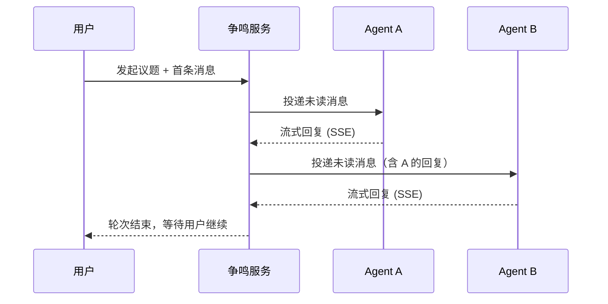

# 争鸣 zhengming

> 百家争鸣 · 诸子论道 — 让多个 AI Agent 围绕同一议题展开多轮辩论的本地工作台。

<p align="center">
  
</p>

## 它是什么

争鸣是一个多 Agent 辩论系统。你抛出一个议题，选择参与讨论的 AI Agent（目前支持 Codex 和 Claude Code），它们会按照你指定的顺序轮流发言、互相质疑、补充推进，直到你喊停。

每个 Agent 拥有独立的会话上下文和工作空间，只能看到自己"还没读过的新消息"，像真实的多方讨论一样运作。

## 核心特性

- **多 Agent 轮流辩论** — 支持自定义发言顺序，Agent 之间互相可见对方观点
- **SSE 实时流式输出** — 每个 Agent 的回复逐字推送到浏览器
- **独立工作空间** — 每个议题拥有隔离的文件空间，支持共享文档和 artifacts
- **会话续用** — Agent 的对话上下文跨轮次保持，不会每轮重建
- **中途干预** — 随时止言、追问、或指定某个 Agent 继续发言
- **古典中式 UI** — 青铜墨韵设计语言，朱红印章、宣纸质感

## 快速开始

```bash
# 克隆
git clone https://github.com/lingge879/zhengming.git
cd zhengming

# 安装依赖
pip install fastapi uvicorn

# 启动
uvicorn run:app --host 127.0.0.1 --port 8765 --reload
```

浏览器打开 http://127.0.0.1:8765

## 前置条件

争鸣通过子进程调用 Agent CLI，你需要在本机安装至少一个：

- [Claude Code](https://docs.anthropic.com/en/docs/claude-code) — `claudecode` agent
- [Codex CLI](https://github.com/openai/codex) — `codex` agent

## 项目结构

```
zhengming/
├── run.py                  # 入口
├── app/
│   ├── main.py             # FastAPI 应用
│   ├── config.py           # 路径与默认配置
│   ├── db.py               # SQLite 初始化
│   ├── routers/            # API 路由
│   ├── services/
│   │   ├── orchestrator.py # 核心编排：轮次调度、流式输出、取消控制
│   │   ├── adapters/       # Agent CLI 适配器（codex / claude）
│   │   └── ...             # 消息、会话、状态、事件等服务
│   ├── templates/          # Jinja2 页面模板
│   └── static/             # CSS、图标、favicon
├── defaults/
│   ├── AGENTS.md           # Agent 默认人设模板
│   └── CLAUDE.md           # Claude Code 默认约束模板
└── tests/
```

## 工作原理



## 许可证

MIT
